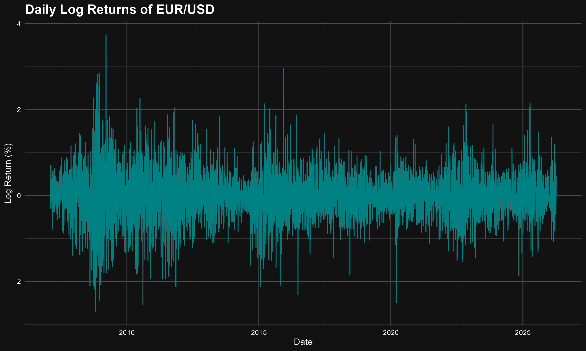

# 📉 EUR/USD Volatility Modeling (GARCH)
  

## 📊 Project Overview
I developed this project to analyze risk clustering in the foreign exchange market. Using the `rugarch` package, I built a GARCH(1,1) model to forecast the conditional volatility of the EUR/USD currency pair. 

## 🛠️ Key Features
* **Financial Data Engineering:** Processed raw API data into log returns to ensure time-series stationarity. 
* **Statistical Testing:** Conducted **Ljung-Box** tests to confirm the presence of ARCH effects (volatility clustering). 
* **Volatility Modeling:** Applied a **GARCH(1,1)** model with a **Student-t distribution** to account for "fat tails" (leptokurtosis) commonly found in Forex returns. 
* **Risk Forecasting:** Generated five-day volatility forecasts to visualize projected market risk. 

## 📈 Visualizations

*Figure 1: Comparison of actual log returns against a theoretical normal distribution, highlighting non-normal "fat tails."* 

*Figure 2: Conditional volatility over time, identifying periods of high market turbulence.* 

---
*Developed by Jeremy Brown — University of the West Indies, Mona* [cite: 1, 15]
